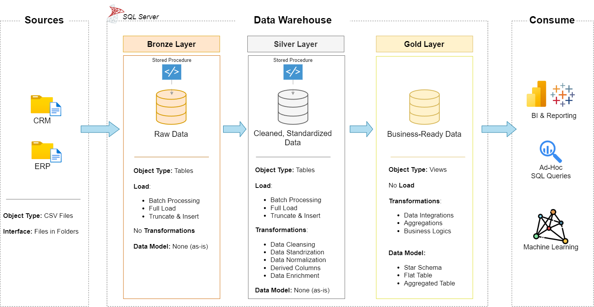

# Data Warehouse and Analytics Project (MySQL)

Welcome to the **Data Warehouse and Analytics Project** repository! 🚀

This project demonstrates an end-to-end **Data Warehouse** solution built using **MySQL 8.0**, following the **Medallion Architecture** (Bronze, Silver, and Gold layers). It covers the complete ETL process, data modeling, and analytical reporting, showcasing best practices in data engineering and SQL development.

---

# 🏗️ Data Architecture

The project follows the **Medallion Architecture**, consisting of three logical layers:



### Bronze Layer
- Stores raw data imported directly from CSV files.
- Preserves the original source data without transformations.

### Silver Layer
- Cleanses, standardizes, validates, and transforms the raw data.
- Resolves data quality issues and prepares the data for analytics.

### Gold Layer
- Provides business-ready analytical views using a star-schema design.
- Contains dimension and fact views optimized for reporting and analysis.

---

# 📖 Project Overview

This project demonstrates the complete lifecycle of building a modern data warehouse using MySQL.

The project includes:

- Designing a data warehouse using the Medallion Architecture.
- Building ETL pipelines using MySQL Stored Procedures.
- Cleaning and transforming data from multiple source systems.
- Creating business-ready dimension and fact views.
- Performing data quality validation across all warehouse layers.
- Writing SQL analytics for business reporting.

---

# 🎯 Skills Demonstrated

This project showcases practical experience in:

- MySQL 8.0
- SQL Programming
- ETL Development
- Data Warehousing
- Data Modeling
- Data Cleansing
- Stored Procedures
- Window Functions
- Data Quality Validation
- Business Analytics

---

# 🛠️ Technologies Used

- **Database:** MySQL 8.0
- **Language:** SQL
- **Source Files:** CSV
- **ETL:** MySQL Stored Procedures
- **Modeling:** Star Schema
- **Architecture:** Medallion Architecture
- **Documentation:** Markdown & Draw.io

---

# 🚀 Project Requirements

## Objective

Develop a modern data warehouse using **MySQL** to consolidate ERP and CRM sales data into a single analytical data model.

---

## Functional Requirements

- Import CSV files into the Bronze layer.
- Clean and standardize source data.
- Integrate ERP and CRM datasets.
- Build analytical dimension and fact views.
- Perform data quality validation.
- Generate SQL-based analytical reports.

---

# 📂 Repository Structure

```text
data-warehouse-project/
│
├── datasets/                          # Raw CSV datasets
│
├── docs/
│   ├── data_architecture.drawio
│   ├── data_architecture.png
│   ├── data_catalog.md
│   ├── data_flow.drawio
│   ├── data_models.drawio
│   └── naming_conventions.md
│
├── scripts/
│   ├── bronze/
│   │   ├── create_bronze_tables.sql
│   │   ├── load_bronze_layer.sql
│   │   └── bronze_quality_checks.sql
│   │
│   ├── silver/
│   │   ├── create_silver_tables.sql
│   │   ├── load_silver_layer.sql
│   │   └── silver_quality_checks.sql
│   │
│   └── gold/
│       ├── create_gold_views.sql
│       └── gold_quality_checks.sql
│
├── tests/
│
├── README.md
├── LICENSE
└── .gitignore
```

---

# 📊 Data Warehouse Layers

## Bronze Layer

- Raw data imported from CSV files.
- No business transformations.
- Acts as the landing zone.

---

## Silver Layer

- Removes duplicates.
- Cleans invalid records.
- Standardizes values.
- Corrects inconsistent data.
- Validates business rules.

---

## Gold Layer

Business-ready analytical views including:

- Customer Dimension
- Product Dimension
- Sales Fact

These views are designed for dashboards, reporting, and SQL analytics.

---

# ✅ Data Quality

Quality checks are implemented throughout the warehouse to validate:

- Duplicate primary keys
- Null values
- Invalid dates
- Data standardization
- Referential integrity
- Business rule validation

---

# 📈 Future Improvements

Potential enhancements include:

- Slowly Changing Dimensions (SCD Type 2)
- Incremental ETL loading
- ETL scheduling
- Performance optimization
- Index tuning
- Dashboard integration using Power BI or Tableau
- Automated data quality reporting

---

# 🛡️ License

This project is licensed under the MIT License.

You are free to use, modify, and distribute this project with proper attribution.
